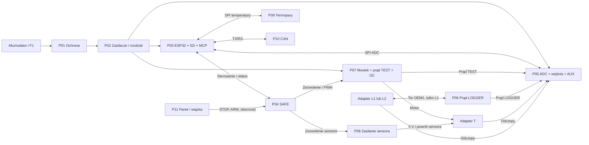

# EGRLab MOD v0.1 - podział na płytki

22.09.2026. Podstawa: EGRLab v4.1 wraz ze schematem S1 i dodatkiem EGRLab-PWR-THT-v1. Zakres obejmuje całe urządzenie Kia Sportage 1.7 CRDi 2013 / EGR 28410-2A850.

**Decyzja: 10 podstawowych PCB funkcjonalnych, opcjonalna PCB panelu P11, trzy małe wkładki adapterów oraz przyrząd uruchomieniowy P00.** Każda płytka ma własne złącza zasilania, punkty pomiarowe i procedurę odbioru. Brak jednej z płytek nie powinien uniemożliwiać sprawdzenia pozostałych na stole.

To projekt podziału, interfejsów i kolejności uruchamiania. Nie zawiera jeszcze schematów CAD poszczególnych PCB, footprintów, trasowania ani Gerberów. Wymiary są rezerwacją miejsca do pierwszego rozmieszczenia elementów, a nie zatwierdzonym obrysem. Istniejące wersje pozostają niezmienione. Nowe funkcje opisane jako wymagania MOD nie są już zaimplementowane w firmware ani netliście v4.1.

## 1. Płytki

| PCB | Funkcja i zawartość | Rezerwa miejsca | Samodzielny odbiór |
|---|---|---|---|
| P01 PROTECT | Cały PWR-THT: TVS, Schottky, MOSFET, OVP/UVLO, własne zasilanie sterowania, wyjście błędu | około 100 x 120 mm; radiatory poza obrysem, w razie potrzeby większa | Zasilacz regulowany i obciążenie; progi, start, prąd wsteczny, temperatura |
| P02 PSU | TSR 5 V i 3,3 V, F2/F3, rozdział zasilania, punkt połączenia powrotów mocy | 70 x 60 mm | Obciążenia zamiast pozostałych płytek; regulacja, tętnienia, zanik szyn |
| P03 CORE | Posiadany Waveshare, MCP23017, microSD, UART, bufory interfejsów i nadzór lokalnego resetu | 100 x 80 mm, po pomiarze Waveshare | PSRAM, zapis SD, GPIO, I2C i reset bez ADC oraz napędu |
| P04 SAFE | Watchdog, STOP, ARM, zatrzask, interlock, bramki zezwolenia, wejścia gotowości modułów | 80 x 70 mm | Generator impulsów i przełączniki P00, bez procesora i bez silnika |
| P05 DAQ | AD7606B z kondensatorami, KMEAS1-3, KCUR, dolne dzielniki, filtry, AUX, pomiar VPROT, filtr 5V_A i jego nadzór | 100 x 90 mm | Znane napięcia na 8 kanałach, identyfikacja, szum, zakresy, SPI |
| P06 I-LOGGER | RSH_L, INA240, rezystory Kelvin, RO2, gniazdo mostka bocznika | 50 x 45 mm | Prąd wzorcowy obu znaków i napięcie common-mode, bez ECU |
| P07 DRIVE | VNH5019 na nośniku, F4, KPWR, C_BULK, TVS, RSH_T, INA240, lokalne okno OC i blokada napędu | 100 x 90 mm plus radiator/nośnik | Najpierw pomiar prądu i blokady; potem mostek z 12 Ω na radiatorze |
| P08 SENSOR | TPS2553, KSENSOR odcinający oba przewody, lokalny driver cewki i nadzór | 50 x 45 mm | Rezystor zamiast sensora, limit prądu, rozłączenie plusa i powrotu |
| P09 TEMP | Dwa moduły MAX31856 z wejściami termopar K, lokalne filtry i obsługa MISO | 70 x 50 mm | Temperatura otoczenia, źródło porównawcze, przerwana termopara |
| P10 CAN | TCAN1051V, ochrona przy złączu, fizyczne silent | 50 x 40 mm | Magistrala laboratoryjna, odbiór bez nadawania i ACK |
| P11 PANEL, opcjonalna | Pasywne rozprowadzenie przycisków, kontrolek i styków obecności adapterów | 80 x 40 mm lub bez PCB | Ciągłość przewodów, tabela interlocku; brak aktywnej elektroniki |

P01 jest największa, ponieważ pozostaje w całości przewlekana. Nie dzielić bramki MOSFET-a i jej sterownika pomiędzy dwie płytki tylko dla uzyskania mniejszego obrysu. Taki podział pogarsza kontrolę przepięć i komplikuje bezpieczny stan po odłączeniu kabla.

P03, P05, P07 i P09 są płytkami nośnymi dla posiadanych/kupnych podzespołów. LQFP ADC oraz drobne układy można zamontować na przygotowanych adapterach lub zlecić ich obsadzenie. Podział na moduły nie oznacza, że wszystkie układy v4.1 mają obudowy DIP. PWR-THT pozostaje przewlekany. Obrys P03 musi uwzględnić antenę, USB i faktyczne rozstawy złączy Waveshare.

## 2. Połączenia bloków

Diagram pokazuje główne funkcje; pełniejsze grupy połączeń opisano w `INTERFEJSY.md`. Zasilanie i sygnały gotowości pominięte na rysunku nie są opcjonalne. P06 nie ma przewodowego połączenia toru mocy z wyjściami P07. Ani masa czujnika ECU, ani przewody silnika sterowanego przez ECU nie są masą urządzenia.

## 3. Granice, których nie rozcinamy taśmą

1. **Bocznik, pary Kelvin, INA240 i wejściowe rezystory pozostają na jednej PCB.** Z P06/P07 wychodzi już sygnał prądu o większej amplitudzie przez rezystor wyjściowy, z przewodem odniesienia. Na P07 lokalne OC wykorzystuje sygnał przed rezystorem wyjściowym; wypięcie kabla ADC nie odłącza OC. Połączenie Kelvin wynika także z [wytycznych TI INA240](https://www.ti.com/lit/ds/symlink/ina240-q1.pdf).
2. **Przekaźniki KMEAS/KCUR, dolne dzielniki, filtry kanałów i ADC zostają na P05.** Nie tworzymy osobnej płytki z ośmioma filtrami połączonej długą taśmą z ADC. Przewody od adapterów są już wysokoimpedancyjne; nie dokładamy im kolejnych odcinków i złączy bez potrzeby.
3. **Kondensatory odniesienia i zasilania ADC są przy jego nóżkach.** Adapter LQFP nie może odsunąć ich o kilkanaście centymetrów. P05 dostaje ciągłą lokalną płaszczyznę masy i osobne obszary elementów analogowych/cyfrowych, zgodnie z [AD7606B, Layout Guidelines](https://www.analog.com/media/en/technical-documentation/data-sheets/AD7606B.pdf).
4. **KPWR, kondensator 1000 µF, TVS i VNH5019 pozostają przy sobie na P07.** Nie wynosimy kondensatora silnika na PSU. Driver cewki oraz tłumienie cewki także lokalnie.
5. **SD pozostaje na CORE.** Unikamy dodatkowego odcinka SPI i odgałęzienia dla urządzenia o impulsowym poborze prądu. Gniazdo ma lokalny kondensator i punkt pomiarowy zasilania.
6. **Wejścia termopar i złącza K pozostają na TEMP**, z dala od radiatorów, przetwornic, MCU i silnika. Dla przedłużenia termopary używamy przewodu kompensacyjnego oraz właściwych złączy, nie zwykłej taśmy miedzianej.

## 4. Adaptery jako oddzielne, małe zespoły

AT, AL1 i AL2 mają osobne rezystory 2 x 150 kΩ na każdy odczep motorowy oraz 2 x 49,9 kΩ na każdy odczep OEM4/5/6. Rezystory montuje się przy złączu/sondzie EGR, przed długim przewodem. Wkładki mogą mieć około 30 x 40 mm, po dopasowaniu mechaniki do obudowy.

- **AT:** odczepy, JP4/JP5/JP6 i mostek pętli T.10-T.11. Zasilanie czujnika z P08. Tylko dwie zworki, według pasywnej identyfikacji. Prąd silnika prowadzić grubymi przewodami lub odpowiednio zaprojektowaną miedzią.
- **AL1:** przelot OEM3/4/5/6 bez ingerencji; OEM1 przez krótki tor do bocznika P06 i z powrotem. Odczepy po stronie zaworu. Bocznik zostaje na P06 w obudowie urządzenia, jak w v4.1; nie przenosimy go w tej rewizji do komory silnika.
- **AL2:** sondy bez rozpinania EGR, wyłącznie odczepy napięciowe; brak pomiaru prądu. Pierwszy etap diagnostyki auta.

Gniazda panelowe T/L1/L2 nadal mają trzy różne klucze. P11 nie jest wspólną płytką mocy tych gniazd: przewody silnikowe idą bezpośrednio do P06/P07, odczepy do P05, styki obecności do P04. Nie wolno dopuścić do jednoczesnego dołączenia dwóch adapterów pomiarowych.

## 5. Co świadomie powielamy

- Driver cewek U18 z v4.1 dzielimy na lokalne drivery P05, P07 i P08. Można użyć trzech TBD62083APG, wykorzystując tylko potrzebne kanały. Nieużywane wejścia ustalamy; COM pozostaje zgodny z lokalnym układem tłumienia. Nie prowadzimy przewodów węzłów cewkowych przez całą obudowę.
- Każdy moduł ma własne odsprzęganie, stan spoczynkowy wejść przy odbiorniku, punkty pomiarowe i rozłączalny tor zasilania do pomiaru poboru.
- P07 dostaje lokalny nadzór doprowadzonego 5V_A oraz logiki, ponieważ dobry wynik pomiaru na P05 nie dowodzi poprawnego napięcia po przejściu przez złącze.
- Bufory potrzebne do pracy z odłączoną płytką lub inną kolejnością zasilania umieszczamy przy odbiornikach. Rezystor szeregowy nie zastępuje blokady zasilania pasożytniczego.
- Każda płytka może mieć kontrolkę zasilania. Nie montujemy jej na precyzyjnym wzorcu ani na wejściu ADC; sama LED nie potwierdza poprawnego zakresu napięcia.

Nie powielamy bez analizy: pull-up SAFE_N, pull-upów I2C, terminacji CAN, dolnych rezystorów torów ADC, elementów odniesienia czy zwór łączących masy. Jeden wspólny wzorzec dla całego urządzenia również nie jest konieczny: zachowujemy zakresy i kalibrację określone w v4.1.

## 6. Łączenie płytek

Na pierwszą wersję wybieram **krótkie wiązki punkt-punkt**. Płytki leżą obok siebie na dystansach, z dostępem do obu stron i sond oscyloskopowych. CORE i DAQ są sąsiadami. PROTECT/PSU/DRIVE leżą w części mocy, TEMP przy chłodnej ścianie obudowy. Każdą płytkę można wyjąć bez demontażu stosu.

Sygnały cyfrowe: IDC 2,54 mm w osłonie, z kluczem i odciążeniem; co drugi przewód masowy. Zasilanie i prądy silnika: osobne blokowane złącza o dobranej obciążalności, z grubymi przewodami. Analog: osobna krótka wiązka, bez zegara/PWM w tej samej taśmie. Nazwy na obu końcach przewodu muszą wskazywać oba moduły, np. `C-ADC: P03 ↔ P05`.

Złącze z kluczem chroni przed obrotem, ale dwa identyczne kluczowane gniazda nadal można zamienić. Dla różnych funkcji stosować różne liczby styków lub dodatkowe mechaniczne kodowanie. Kolor i opis są uzupełnieniem, nie jedyną blokadą pomyłki. Wtyki mocy, sensora i analogów nie mogą pasować do IDC cyfrowego.

Założenia do pierwszego prototypu: ADC-SPI do 10 cm, TEMP-SPI do 10 cm, sterowanie do 20 cm, wewnętrzne odczepy wysokoimpedancyjne możliwie poniżej 5 cm. To limity projektowe do sprawdzenia oscyloskopem, nie uniwersalne gwarancje działania. Nie wynikają wyłącznie z częstotliwości zegara; znaczenie mają zbocza, masa i pojemność przewodu.

**Złącza krawędziowe są możliwe w następnej mechanice**, szczególnie dla cyfrowych kart. Wymagają ustalonej grubości PCB, właściwej metalizacji styków, blokady kierunku i karty, tolerancji mechanicznych oraz weryfikacji prądów każdego styku. Duży wspólny backplane nie jest potrzebny do pierwszego uruchomienia. Nie przewidujemy hot-plug. Wyłączenie zasilania poprzedza rozłączanie każdej wiązki.

## 7. Wymagania bezpieczeństwa w wersji modułowej

SAFE_N z otwartymi kolektorami pozostaje, z jednym pull-upem przez NC STOP. **Otwarte wyjście błędu po przerwaniu przewodu wygląda jak brak błędu.** Dlatego dokładamy sprzętowe sygnały gotowości, których stanem bez zasilania lub po wypięciu jest 0, oraz pętle obecności złączy. Szczegóły i brakujące elementy schematowe są w `INTERFEJSY.md`.

Rozróżniamy `MECH_OK` (klucz, brak LOGGER, mostek adaptera T) i `MODULES_OK` (moduły potrzebne do aktywnego TEST). W MOD sygnał `INTERLOCK` będzie ich iloczynem logicznym. Zanik INTERLOCK kasuje ARM, jak w v4.1. Powrót warunków nie może przywrócić ruchu bez nowego ARM.

P07 ma dodatkowo lokalne wyłączenie od OC i zaniku własnych szyn. Nie czeka wtedy na obieg sygnału przez CORE lub na ADC. Lokalne wejścia MOTOR_PERMIT/PWM/kierunku mają bezpieczne stany przy odłączonej wiązce. Lokalny błąd OC zatrzaskuje wyłączenie do wycofania zezwolenia; nie może dawać serii automatycznych restartów. P04 nadal wymaga nowego ARM.

Sygnały gotowości nie mogą zależeć od zezwolenia, które same umożliwiają: `DRIVE_OK` oznacza sprawną elektronikę i brak zatrzaśniętej awarii, nie zamknięty KPWR. `SENSOR_OK` nie wymaga już włączonego KSENSOR. W przeciwnym razie powstałaby blokada startu.

Nie deklarujemy wykrywania dowolnego zwarcia ani przerwania każdego pinu. Przykładowo zwarta do 3,3 V linia READY może udawać gotowość. Weryfikujemy konkretne usterki i zapisujemy ich pokrycie; nie nazywamy tego rozwiązaniem SIL/ASIL.

## 8. Masa i zasilanie

P02 wyznacza punkt rozdziału zasilania i połączenia grubych powrotów. P07 ma dedykowaną parę zasilania mocy i nie pobiera prądu silnika przez masę IDC. Zewnętrzny punkt odniesienia pozostaje jeden: B- z J_PWR. OBD 4/5/16 nadal NC. Masa sensora ECU jest wyłącznie mierzona przez rezystory, a nie dołączana do masy urządzenia.

Na PCB pomiarowej stosujemy ciągłą płaszczyznę GND i rozdzielamy lokalizację prądów, nie wycinamy szczeliny pod SPI. W nieizolowanym urządzeniu masy wiązek sygnałowych tworzą dodatkowe połączenia między modułami. Nie twierdzimy więc, że całość jest idealną gwiazdą ani że żaden prąd nie popłynie inną drogą. Krótki, niskoimpedancyjny powrót mocy oraz pomiar różnic potencjałów przy obciążeniu są obowiązkowe. Jeśli błędy masy nie mieszczą się w budżecie pomiaru, potrzebna będzie zmiana prowadzenia powrotów lub izolacja wybranej granicy.

P05 wytwarza filtrowaną 5V_A i zasila nią INA na P06/P07 osobnymi parami z przewodem odniesienia. Nie łączymy równolegle niezależnych źródeł 5V_A. Każdy INA ma lokalne kondensatory. P07 monitoruje napięcie na swoim końcu przewodu. P06 bez prawidłowego zasilania nie dostarcza ważnego pomiaru prądu, nawet jeśli jego wyjście nie jest równe zeru.

Dwie szyny 3,3 V znane z v4.1 pozostają odrębne: regulator Waveshare i 3V3_IO z TSR. **Nie wolno ich połączyć równolegle.** Schemat CORE wymaga dopracowania ochrony wszystkich granic tych domen, w tym dwukierunkowego I2C do MCP; nie wystarczy wstawić zwykły bufor jednokierunkowy. Odbiór obejmuje obie kolejności pojawiania/zaniku zasilania oraz USB. Dokładny wariant buforów/sekwencjonowania jest zadaniem schematu P03, przed zamówieniem tej PCB. Dokumentacja rodziny [Waveshare](https://docs.waveshare.com/ESP32-S3-DEV-KIT-N8R8/Resources-And-Documents) wymaga jeszcze zestawienia z rewizją posiadanego egzemplarza.

Na odbiorczych granicach jednokierunkowych przewidujemy bufory z określonym `Ioff`, np. rodzinę [SN74LVC244A](https://www.ti.com/lit/ds/symlink/sn74lvc244a.pdf), zasilane z domeny chronionego odbiornika. Stan OE i nadzór brownout też wymagają projektu: Ioff przy 0 V nie rozwiązuje sam całego przebiegu zaniku napięcia. Dla wspólnego MISO bufor ma być trójstanowy i sterowany CS; stale aktywny bufor spowodowałby konflikt SD z temperaturami.

PWR-THT ma limit pojemności bezpośrednio na VPROT podczas startu 220 µF. Jego własne 100 µF już się wlicza. W S1 wejścia dwóch TSR dodają łącznie 20 µF, więc przed doliczeniem tolerancji pozostaje około 100 µF na inne bezpośrednie obciążenia tej szyny. Pojemności za przetwornicami nie dodaje się arytmetycznie do tego limitu, lecz ich energia i prąd startowy też obciążają ochronę. C_BULK silnika pozostaje za otwartym KPWR. Nie dodawać po 100 µF na VPROT każdej płytki bez ponownej analizy startu.

## 9. Co zachowujemy i co będzie wymagało zmiany

Zachowujemy 8 kanałów ADC, rozdział TEST/LOGGER, adaptery T/L1/L2, fizyczny ARM, progi prądu, główne GPIO, adres MCP 0x20, format danych oraz metodę pasywnej identyfikacji pinów. Kanały 1-5: OEM1/3/4/5/6, CH6: wybrane INA, CH7: VPROT, CH8: AUX. Żaden nowy moduł nie może nadawać napięcia na ECU przez pomyłkę wyboru trybu.

Zmiany wykonawcze: podział U18 na trzy lokalne drivery, przeniesienie OC na DRIVE, nowe nadzory i gotowości, bufory, złącza, obecność wiązek, diagnostyka brakujących modułów. Po montażu ponownie kalibrujemy całe tory wraz z wiązkami. Nie zakładamy identycznego szumu tylko dlatego, że wartości rezystorów są te same.

Firmware potrzebuje osobnego wariantu uruchomieniowego: test modułu bez pozostałych peryferiów, jawna maska dostępnych modułów, brak aktywnego TEST przy braku wymaganego modułu, rejestrowanie powodów blokady. Nie generuje on produkcyjnego heartbeat z pominięciem świeżości ADC. Generator heartbeat P00 jest narzędziem do testu SAFE bez podłączonego napędu.

Aktualne zegary v4.1 wynoszą: ADC SPI 8 MHz, SD do 10 MHz, MAX31856 1 MHz. Pierwszy odbiór nowej wiązki ADC może użyć obniżonego zegara, np. 1 MHz, ale trzeba wtedy policzyć pełny czas konwersji i odczytu oraz sprawdzić timeouty. Sam transfer 128 bitów to 128 µs przy 1 MHz. To nie gwarancja zachowania 2 kS/s całego firmware. Powrót do 8 MHz wymaga kontroli zboczy i błędów, nie wyłącznie udanego startu.

## 10. Jak korzystać z pakietu

1. `KOLEJNOSC.md`: kolejność budowy i warunki przejścia do następnej płytki.
2. `INTERFEJSY.md`: kontrakty połączeń, przykładowy pinout ADC i wymagania gotowości.
3. `mapa-elementow.csv`: przypisanie wszystkich elementów schematu S1 do docelowych zespołów; nie jest nowym BOM do zamówienia.
4. `moduly.csv`, `interfejsy.csv`, `odbior.csv`: zestawienie do planowania i wpisywania wyników.
5. `WERYFIKACJA.md`: co sprawdzono w podziale i co należy zakończyć przed produkcją PCB.

Pierwszy pakiet do rozrysowania w CAD: P01, P02, P04 oraz P00. Pierwszy pakiet pomiarowy: P03, P05, P09, następnie P06 i P10. P07 i P08 są rozrysowywane z ustalonym kontraktem SAFE, a uruchamiane przed podłączeniem zaworu. Schematy wszystkich złączy trzeba uzgodnić przed zamówieniem pierwszych płytek, aby kolejne serie pasowały mechanicznie i elektrycznie.
