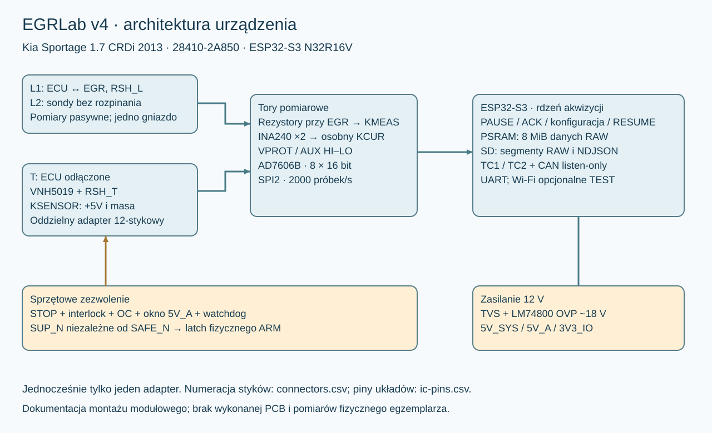

# EGRLab v4

Tester i rejestrator dla Kia Sportage 1.7 CRDi 2013, EGR 28410-2A850. MCU: posiadany Waveshare ESP32-S3-DEV-KIT-N32R16-M z modułem N32R16V. Nie ma potrzeby wymiany procesora.

Ta rewizja obejmuje poprawki R01–R13 z przeglądu v3, projekt modułowy, firmware ESP-IDF, narzędzia analizy i testy regresji. Oryginalne v3 pozostaje niezmienione.

## Dokumenty

- [Zmiany v3 → v4](docs/00-zmiany-v3-v4.md).
- [Projekt elektryczny](docs/01-projekt.md) i [szczegóły połączeń](docs/07-polaczenia.md).
- [BOM](hardware/BOM.csv), [wartości i oznaczenia elementów pasywnych](hardware/BOM-passives.csv), [piny układów](hardware/ic-pins.csv), [połączenia](hardware/connections.csv), [złącza](hardware/connectors.csv), [GPIO](hardware/pinout.csv).
- [Uruchomienie etapami](docs/03-uruchomienie.md) i [formularz odbioru](verification/ODBIOR.md).
- [Procedury diagnostyczne](docs/02-procedury.md).
- [Firmware, komendy i format logów](docs/04-firmware-logi.md).
- [Źródła](docs/05-zrodla.md) i [wyniki weryfikacji](docs/06-weryfikacja.md).



## Zakres wykonania

Pakiet służy do budowy etapami przez elektronika. Zawiera schematy blokowe, funkcjonalny schemat zabezpieczeń i pinowe listy połączeń. **Nie zawiera gotowej PCB/Gerberów ani pomiarów fizycznego egzemplarza.** Wyniki testów programowych nie są pomiarami elektrycznymi ani kwalifikacją EMC urządzenia.

Aktywny TEST pozostaje domyślnie zablokowany: `CONFIG_EGR_ACTIVE_TEST=n` i `EGR_HARDWARE_ACCEPTED=0`. Odblokowanie po odbiorze opisano w rozdziale 03. Fizyczny ARM jest nadal wymagany. Wyjścia testera nie łączy się z ECU.

## Szybki start narzędzi

Python 3.10+, w katalogu projektu:

```text
python -m unittest discover -s tests -v
python tools/egrlog.py inspect examples
python tools/egrlog.py report examples --html raport.html
python tools/egrlog.py export examples --csv okno.csv --from 0.9 --to 1.1
python tools/egrlog.py report examples --html okno.html --from 0.9 --to 1.1 --full
```

HTML działa bez Internetu. Przykłady są syntetyczne. Brak konfiguracji w formacie 3/4 daje puste wielkości fizyczne, nigdy domyślną skalę. Dokumenty `docs/history/` służą wyłącznie historii zmian.

`BOM-passives.csv` rozwija pozycje zbiorcze BOM; tych samych oznaczeń nie kupuj podwójnie. Schematy do druku są też w PNG w `hardware/`.
