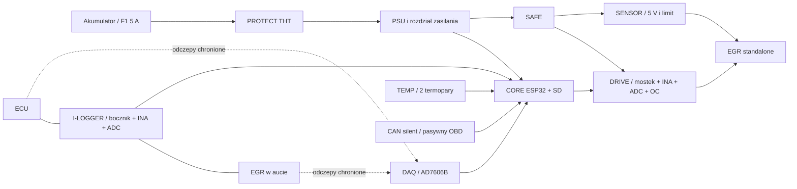

# Architektura i decyzje v5

Cel: powtarzalny zapis zachowania zaworu, sterowania, zasilania, masy i temperatury w kilku samochodach. Sam nawracający P0404 nie przesądza o uszkodzeniu zaworu. Porównujemy egzemplarze i warunki, zamiast zakładać wspólną przyczynę wszystkich przypadków.

## Moduły

| PCB | Funkcja | Możliwa samodzielna wymiana |
|---|---|---|
| P01 PROTECT | Bezpiecznik zewnętrzny, odwrotna polaryzacja, blokowanie prądu wstecznego, OVP/UVLO, TVS | Inna ochrona wejścia po odbiorze granic VPROT |
| P02 PSU | 5 V, 3,3 V, rozdział powrotów i gotowość | Inne przetwornice przy tych samych granicach i pinach |
| P03 CORE | Posiadany Waveshare, MCP23017, SD, dekoder CS, bufory | MCU/SD; konieczny port firmware |
| P04 SAFE | STOP, ARM, watchdog, zatrzask, suma gotowości | Samodzielny odbiór na P00 |
| P05 DAQ | 8 kanałów napięcia AD7606B, filtry, odłączanie wejść | Zmiana ADC wymaga nowego sterownika i kalibracji |
| P06 I-LOGGER | Bocznik 5 mΩ, INA240A2, lokalne ADC i BYPASS | Nowa metoda pomiaru prądu bez przebudowy DAQ |
| P07 DRIVE | VNH5019, własny pomiar prądu, niezależne OC i zatrzask | Inny mostek po sprawdzeniu zakresów i sterownika |
| P08 SENSOR | Osobne zasilanie czujnika, limit, rozłączanie + i powrotu | Inne napięcie/czujnik: nowa PCB i zgodny adapter |
| P09 TEMP | Dwa MAX31856 i izolowane termopary K | Inne czujniki temperatury / sterownik |
| P10 CAN | Pasywny odbiornik magistrali auta | Inny interfejs bez zmiany torów EGR |

P11 PANEL może być wiązką i przyciskami. P00 jest wyposażeniem stołu. Nie ma procesora na każdym module, automatycznego wykrywania każdej rewizji ani obowiązkowych EEPROM-ów.

## Zmiana prądu względem v4.1

Znika KCUR i wymagany przewód analogowy INA→DAQ. AD7606B kanał 6 (indeks 5) jest zakończony 10 kΩ do masy i pozostaje kanałem kontrolnym/rezerwą; nie podłączaj tam wyjścia INA. Prąd pochodzi z lokalnego MCP3201 wybranego według banku. Punkt analogowy INA zachowano dla oscyloskopu i kalibracji.

MCP3201-BI/P jest 12-bitowym SAR w DIP8. SPI 500 kHz, ramka 16 bitów, jedna konwersja w każdym cyklu 500 µs. Nominalny krok prądu wynosi 4,88 mA dla 5 mΩ i wzmocnienia 50. To krok kwantyzacji, nie gwarancja dokładności całego toru. Wybrano go ze względu na łatwy montaż i wystarczającą rozdzielczość do pierwszych prób. Wymienny P06/P07 umożliwia późniejszy ADC o większej rozdzielczości.

Osiem napięć AD7606B jest próbkowanych razem wewnątrz tego układu. MCP3201 rozpoczyna własne próbkowanie później, podczas swojej transakcji SPI. Log zapisuje przedział czasu tej transakcji względem startu AD7606B. Nie jest to pomiar równoczesny między ADC; oversampling x8 AD7606B i filtr analogowy dodatkowo mają własne opóźnienia. Do analizy fazy PWM i bardzo krótkich impulsów potrzebny jest oscyloskop albo przyszły zsynchronizowany moduł. Do trendów, przerw i zachowania w oknach dziesiątek/setek ms ta architektura ma zostać sprawdzona podczas odbioru.

## Zapas i granice

Tor głównego zasilania, połączenia silnika i złącza: dobór na przynajmniej 10 A w docelowym montażu, mimo bezpiecznika urządzenia 5 A. Przewody mocy 2,5 mm²; krótkie odcinki do małych pól nośnika można wykonać 1,5 mm² po sprawdzeniu zacisku i temperatury. Na prototypowych PCB zamiast wąskiej ścieżki stosuj gruby przewód/lutowaną szynę; odbiór temperatury nadal obejmuje styki.

To nie podnosi limitu EGR: program startuje z 1,5 A, dopuszcza do 3,5 A; OC lokalne nominalnie ±4 A. PWM startowo 1 kHz, duty do 0,35. Chłodzenie P01 zostaje według projektu THT: dioda ≤5 K/W, MOSFET ≤10 K/W, osobne lub izolowane elektrycznie radiatory. Budżet P01 przy 5 A około 4,19 W jest obliczeniem, nie pomiarem.

Podłączone jednocześnie LOGGER i TEST nie dają zezwolenia TEST. Oba tory mają różne adaptery. W LOGGER z urządzenia nie podajemy napięcia na przewody czujnika ani silnika ECU.

## Rozwój

Drugi podobny EGR 12 V DC z analogowym feedbackiem może wymagać tylko adaptera i profilu, po sprawdzeniu zakresów/prądów. LIN/CAN, krokowy napęd lub inne zasilanie czujnika wymagają innego modułu i sterownika. M1 jest wersją interfejsów, nie obietnicą zgodności ze wszystkimi zaworami. Nie wolno nadać nowej funkcji zasilającej pinowi zarezerwowanemu bez zmiany wersji i klucza złącza.
